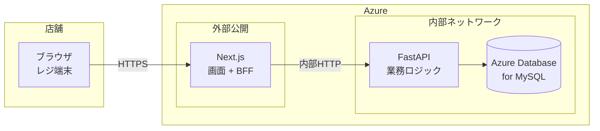
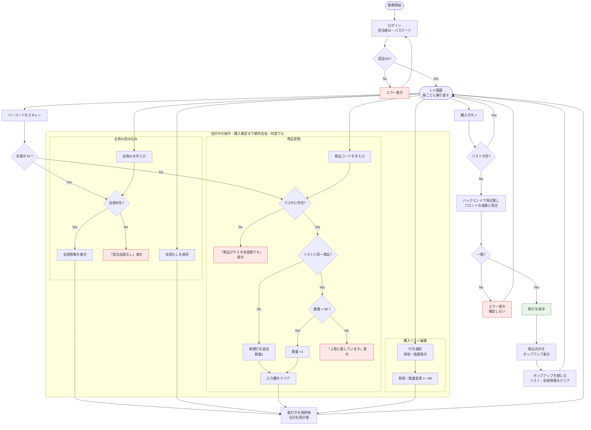
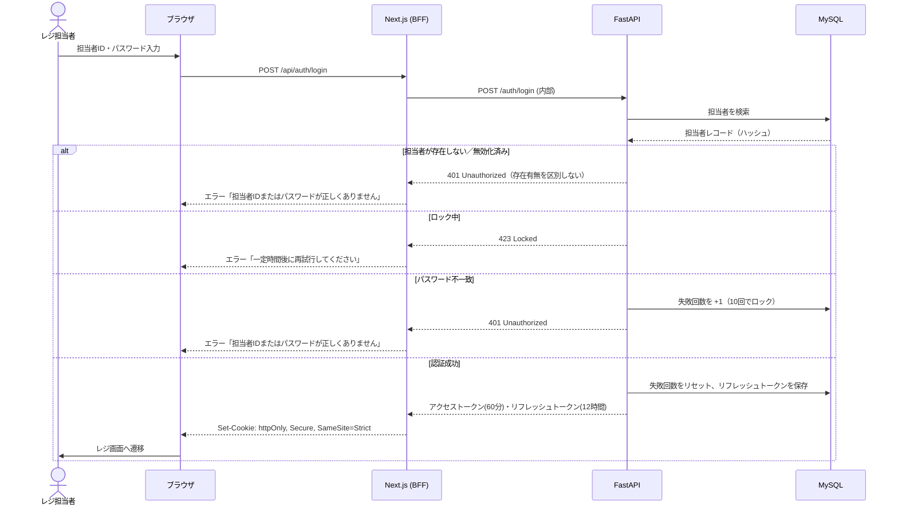
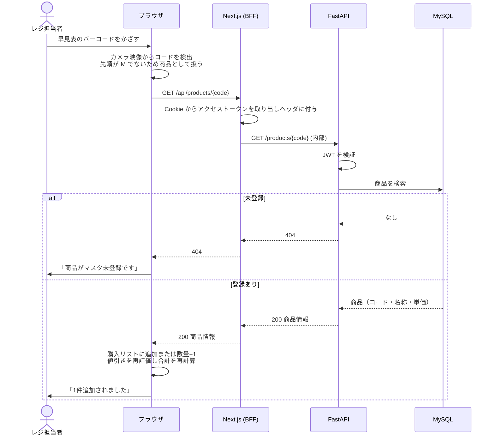
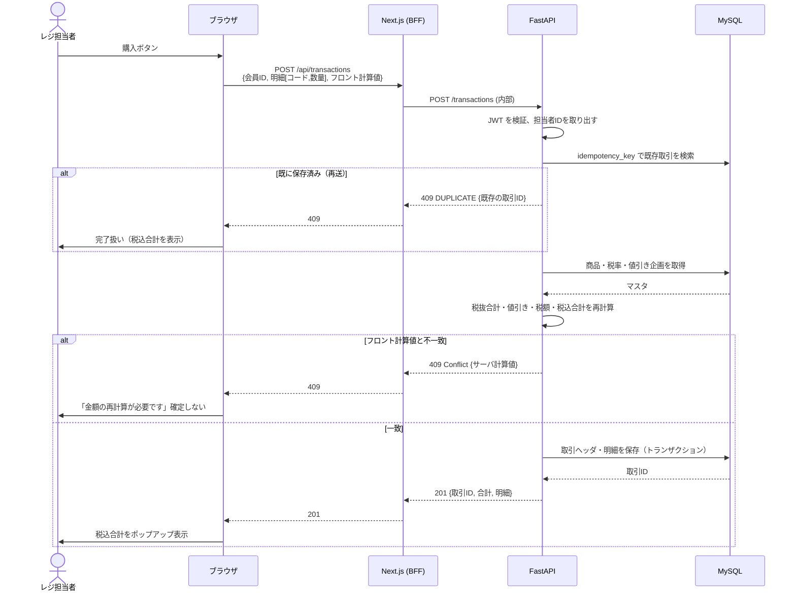
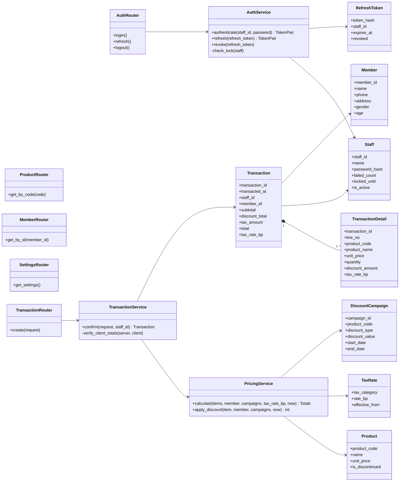
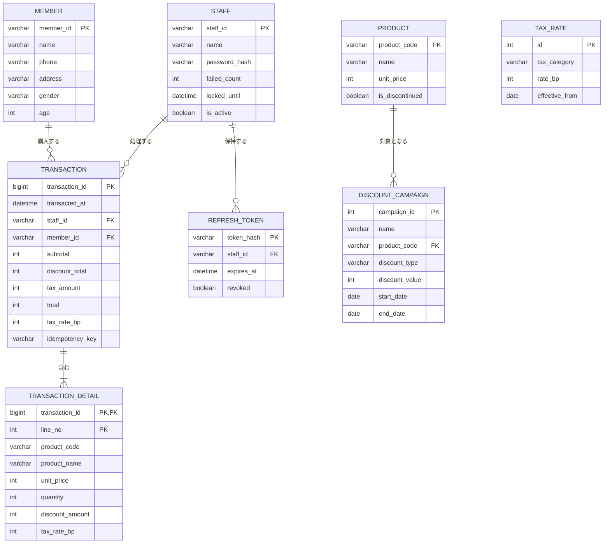
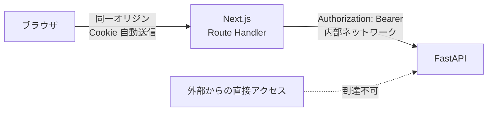

# 簡易POSアプリ改（Lv2）設計仕様書

対象業態：ラーメン店（店内飲食のみ・後払い会計）

| 項目 | 内容 |
|---|---|
| 文書名 | 簡易POSアプリ改（Lv2）設計仕様書 |
| 版 | v1.4 |
| 作成日 | 2026-09-06 |
| 作成者 | おぐちゃん（Tech0 Step4 / 12期） |
| 上位文書 | 簡易POSアプリ改（Lv2）要件定義書 v1.0 |
| ステータス | 確定 |

## 改訂履歴

| 版 | 日付 | 内容 |
|---|---|---|
| v0.1 | 2026-09-06 | 初版ドラフト |
| v1.0 | 2026-09-06 | 全体確認を実施し確定。税率を万分率の整数に変更、会員ID・商品コードの判別方式を追加、API 2 の入出力を追加 |
| v1.1 | 2026-09-13 | テスト設計での指摘により、クラス図 `PricingService.apply_discount` の引数に `member` を追加。6.1 に空白の扱い（フロントで trim、バックは拒否）と未知フィールドの拒否を追記 |
| v1.2 | 2026-09-13 | テスト実装可否の確認により、`calculate` に `now` を追加、複数企画の重複時は値引き額が大きい方を適用（6.1）、テスト用の環境変数（6.3）を追加 |
| v1.3 | 2026-09-13 | 実装着手時の確認（Claude Code からの18件の指摘）により改訂。パスワードハッシュを Argon2id に変更、タイムゾーンを日本時間に固定、Clock を業務用とトークン用に分離、フロントの期間判定を廃止、ロック時の失敗回数リセット、未定義だったエラー応答（存在しない会員ID・明細の重複・トークンなし）、ログアウト時のトークン受け渡し、ローカルの Cookie 属性、DDL の管理方法を追記 |
| v1.4 | 2026-09-14 | 実装（段階8〜9）で確定した事項を反映。APP_ENV 未設定は本番扱い、Cookie の名前・有効期間、追加のセキュリティヘッダ（Referrer-Policy・Permissions-Policy・HSTS）、CSP は nonce 方式、担当者名の表示用 Cookie、DB 接続のタイムアウトと接続の入れ替え（pool_pre_ping は使わない）、BFF のタイムアウト、冪等キーの作り直し規則（同日補正：改訂履歴の順序、CSP の記載を実装に合わせて補完） |

---

## 1. はじめに

### 1.1 本書の目的

本書は、要件定義書で定めた要件を「どう作るか」に落とし込む設計仕様書である。基本設計（システム構成、機能設計、データ設計、API設計）と詳細設計（設定値、エラー処理、セキュリティ実装方針）を1冊にまとめる。

本書はAI駆動開発の入力として用いる。コーディングエージェントに本書を渡して実装させ、人間がレビュー・裁定する前提のため、判断の余地が残らない粒度で記述する。

### 1.2 要件定義書との対応

要件定義書の機能要件（FR-001〜012）・非機能要件（NFR-xxx）の各IDを、本書の設計要素に紐づける。対応表は第8章に示す。

### 1.3 表記ルール

- 図はすべて Mermaid 記法で記述する。GitHub 上でそのまま描画される
- API は `メソッド パス` の形式で表記する（例：`POST /api/transactions`）
- 型定義は TypeScript で示す。Pydantic（バックエンド）は同名・同型のモデルとして実装する
- 要件定義書で設定した値（数量上限99、パスワード12文字など）は本書でそのまま採用し、出典として要件IDを付す

---

## 2. システム構成

### 2.1 全体構成（BFF方式）

ブラウザは Next.js のみと通信し、FastAPI は Next.js からの内部通信でのみ到達できる構成とする。Next.js の Route Handler が BFF（Backend for Frontend）として振る舞い、リバースプロキシの役割を担う。



| 層 | 役割 | 公開範囲 |
|---|---|---|
| ブラウザ | 画面表示、カメラによるバーコード読み取り、入力 | — |
| Next.js | 画面の配信。BFF として認証状態を管理し、FastAPI へリクエストを中継する | インターネットに公開 |
| FastAPI | 業務ロジック（金額計算、値引き判定、永続化）と認証処理 | 内部ネットワークのみ。インターネットから直接到達できない |
| MySQL | データの永続化 | 内部ネットワークのみ |

**BFF 方式を採る理由**

- FastAPI をインターネットに露出させないため、攻撃面が Next.js の1点に絞られる
- トークンを httpOnly Cookie に格納でき、ブラウザの JavaScript から隔離できる（詳細は第7.2節）
- 金額計算は FastAPI で行い、Next.js は中継のみとするため、業務ロジックが1箇所に集約される

### 2.2 技術スタックとバージョン方針

| 種別 | 採用 | 選定理由 |
|---|---|---|
| フロントエンド | Next.js（App Router）／ TypeScript | 前提条件（変更不可）。Route Handler を BFF として使用 |
| バックエンド | FastAPI ／ Python | 前提条件（変更不可） |
| ORM | SQLAlchemy 2.x | FastAPI で標準的。パラメータバインドにより SQL インジェクションを構造的に防ぐ（第7.5節） |
| バリデーション | Pydantic v2 | FastAPI 標準。リクエストの型・範囲検証をスキーマで宣言する |
| 認証 | PyJWT ／ Argon2id（argon2-cffi） | JWT の署名・検証とパスワードハッシュ化。bcrypt は72バイトの入力上限がありパスワード128文字の要件と両立しないため Argon2id を採用 |
| バーコード読取 | ブラウザの Barcode Detection API（非対応ブラウザでは ZXing 系ライブラリにフォールバック） | カメラ付きデバイスでの読み取り（前提条件） |
| DB | Azure Database for MySQL Flexible Server | 前提条件（変更不可） |

**バージョン固定の方針**

- `package.json` は lockfile（`package-lock.json`）で、`requirements.txt` はバージョンを `==` で固定する。同じ環境が再現できることを優先する
- 具体的なバージョン番号は、実装着手時に各パッケージの最新安定版を確認して決定し、第7.6節の脆弱性確認を経て採用する
- メジャーバージョンの更新は、脆弱性対応を除き実装期間中は行わない

### 2.3 Azure 構成

要件 NFR-OPS-01（リクエスト到達時に実行環境の起動を待たない、DB接続を維持する）から、常時稼働型の実行基盤を選定する。

| コンポーネント | Azure サービス | 設定 |
|---|---|---|
| Next.js | Azure Container Apps | 外部 Ingress で HTTPS を終端（HTTP は HTTPS へリダイレクト）。最小レプリカ 1（コールドスタート回避） |
| FastAPI | Azure Container Apps | **内部 Ingress**（同一環境内からのみ到達可）。最小レプリカ 1 |
| MySQL | Azure Database for MySQL Flexible Server | Container Apps 環境からのみ接続を許可。パブリックアクセスは無効 |
| 秘密情報 | Container Apps のシークレット | DB接続文字列、JWT署名鍵を環境変数として注入。コードやリポジトリには含めない（NFR-SEC-10） |
| タイムゾーン | 全コンテナに `TZ=Asia/Tokyo` | 日時はすべて日本時間で扱い、タイムゾーン情報を持たない値として保存・判定する。1店舗の国内システムのため UTC 変換を挟まない |
| DB 接続 | SQLAlchemy の接続プール | 読み書きタイムアウト 10秒、TCP 接続タイムアウト 3秒。`pool_pre_ping` は使わず（接続確認の待ちが読み書きタイムアウトと重なり、最大20秒待つため）、接続を 240秒で入れ替える（Azure の無通信タイムアウト 4分より短く） |
| テーブル作成 | `schema.sql` を管理者権限で実行 | アプリ用 DB ユーザーは DML 権限のみ（7.5）のため、DDL はアプリから実行しない。ローカルは MySQL コンテナの初期化時、Azure は管理者が手動で実行する |

**Azure Functions（従量課金）を採用しない理由**：アイドル後の初回リクエストでコールドスタートが発生し、NFR-PERF-03（久しぶりのアクセスでも極端に遅くならない）を満たさないため。

**Container Apps と App Service の比較**：いずれも常時稼働にできるが、Next.js と FastAPI を同一環境に置き、FastAPI を内部 Ingress で閉じる構成が Container Apps では標準機能で実現できる。App Service で同等の構成を組むには VNet 統合とアクセス制限の設定が別途必要となるため、Container Apps を採用する。

---

## 3. 機能設計（UML）

### 3.1 アクティビティ図：会計業務

要件定義書 3.3 の業務フローを、システムの処理として表す。会計中の操作（会員ID読み込み・商品登録・購入リスト編集）は購入確定までの間、順序を問わず何度でも行える（Lv2 2.8）ため、3つの枠にまとめて描く。枠内の各操作は、終了後にレジ画面へ戻る。



赤の枠はエラー表示で、いずれも表示後にレジ画面へ戻る。緑の枠が取引の確定点であり、ここでのみ購入履歴が保存される。

### 3.2 シーケンス図

BFF 方式のため、ブラウザは常に Next.js とだけ通信し、Next.js が FastAPI へ中継する。以下、代表的な3つの処理を示す。

#### 3.2.1 ログイン（FR-001）



アクセストークンの期限切れ時は、Next.js がリフレッシュトークンで `POST /auth/refresh` を呼び、新しいアクセストークンとリフレッシュトークンの組を取得して元のリクエストを再送する（ローテーション。旧リフレッシュトークンは失効させる）。ブラウザからは透過的に見える。

#### 3.2.2 バーコードスキャンによる商品登録（FR-003、FR-005、FR-006、FR-008）



値引き判定と合計計算に必要な税率・値引き企画は、ログイン直後に `GET /api/settings` で取得しブラウザに保持する。スキャンのたびにサーバへ問い合わせず、NFR-PERF-01（1秒以内）を満たす。

#### 3.2.3 購入確定（FR-010、NFR-SEC-07）



バックエンドは常に自身の再計算結果を正とし、フロント計算値は照合にのみ用いる（第7.3節）。

### 3.3 クラス図

バックエンド（FastAPI）の主要クラスを示す。3層（ルータ／サービス／リポジトリ）に分け、金額計算は `PricingService` に集約する。



**設計上の要点**

- `PricingService` が金額計算の唯一の実装であり、購入確定時の再計算（3.2.3）はここを呼ぶ。フロントエンドにも同じ計算ロジックを TypeScript で実装するが、正とするのは常にこちらである
- `TransactionDetail` がマスタを参照せず値を持つ理由、`RefreshToken` をテーブルとして持つ理由は第4.1節に示す

---

## 4. データ設計

### 4.1 ER図



**設計上の要点**

- `TRANSACTION_DETAIL.product_code` は `PRODUCT` への外部キーを張らない。商品名・単価・税率を明細に転記して保存し（スナップショット）、マスタが後で変更・廃止されても履歴が影響を受けないようにする（Lv2 2.6、NFR-OPS-03）
- `TRANSACTION.member_id` は NULL 許容。会員なしの取引は正常な取引として保存する（BR-06）
- `TRANSACTION.idempotency_key` は購入確定の二重実行を防ぐキー（NFR-OPS-05、第6.2節）。フロントが確定操作ごとに生成する UUID を保存し、同一キーの再送は新規登録せず既存の取引IDを返す
- `PRODUCT.is_discontinued` により論理削除する。販売終了メニューのコードを別商品に再利用しない運用の受け皿となる（要件定義書 付録A）
- `TAX_RATE` は `effective_from` を持ち、日付指定で税率を切り替えられる。取引日時時点で有効な最新の税率を適用する（FR-012）
- `REFRESH_TOKEN` はトークンそのものではなくハッシュ値を保存する。DB が漏えいしてもトークンを再利用できない

### 4.2 テーブル定義

主キー・外部キー・制約を含む定義を示す。文字列長は MySQL の `VARCHAR` 長を表す。

#### staff（担当者マスタ）

| 列名 | 型 | NULL | 既定値 | 説明 |
|---|---|---|---|---|
| staff_id | VARCHAR(20) | 不可 | — | PK。ログインID |
| name | VARCHAR(50) | 不可 | — | 氏名 |
| password_hash | VARCHAR(255) | 不可 | — | Argon2id ハッシュ（NFR-SEC-03） |
| failed_count | INT | 不可 | 0 | 連続認証失敗回数（NFR-SEC-04） |
| locked_until | DATETIME | 可 | NULL | ロック解除日時。NULL はロックなし |
| is_active | BOOLEAN | 不可 | TRUE | 無効化フラグ |

#### member（会員マスタ）

| 列名 | 型 | NULL | 既定値 | 説明 |
|---|---|---|---|---|
| member_id | VARCHAR(20) | 不可 | — | PK。会員証のバーコード値。`M` + 数字（例：M000123） |
| name | VARCHAR(50) | 不可 | — | 氏名 |
| phone | VARCHAR(20) | 可 | NULL | 電話番号。レジ画面・APIレスポンスには含めない（NFR-SEC-09） |
| address | VARCHAR(200) | 可 | NULL | 住所。同上 |
| gender | VARCHAR(10) | 可 | NULL | 性別 |
| age | INT | 可 | NULL | 年齢 |

#### product（商品マスタ）

| 列名 | 型 | NULL | 既定値 | 説明 |
|---|---|---|---|---|
| product_code | VARCHAR(20) | 不可 | — | PK。メニュー早見表のバーコード値。数字のみ（例：1001） |
| name | VARCHAR(100) | 不可 | — | 商品名 |
| unit_price | INT | 不可 | — | 税抜単価（円）。CHECK (unit_price >= 0) |
| is_discontinued | BOOLEAN | 不可 | FALSE | 販売終了フラグ。TRUE の商品は登録できない |

#### tax_rate（税率マスタ）

| 列名 | 型 | NULL | 既定値 | 説明 |
|---|---|---|---|---|
| id | INT | 不可 | AUTO | PK |
| tax_category | VARCHAR(20) | 不可 | 'standard' | 税率区分。Lv2 は 'standard' のみ |
| rate_bp | INT | 不可 | — | 税率（万分率の整数。10% は 1000）。小数を持たない理由は第6.1節 |
| effective_from | DATE | 不可 | — | 適用開始日。UNIQUE (tax_category, effective_from) |

#### discount_campaign（値引き企画マスタ）

| 列名 | 型 | NULL | 既定値 | 説明 |
|---|---|---|---|---|
| campaign_id | INT | 不可 | AUTO | PK |
| name | VARCHAR(100) | 不可 | — | 企画名 |
| product_code | VARCHAR(20) | 不可 | — | FK → product。対象商品 |
| discount_type | VARCHAR(10) | 不可 | — | 'percent' または 'amount' |
| discount_value | INT | 不可 | — | percent は 1〜100、amount は円。CHECK (discount_value > 0) |
| start_date | DATE | 不可 | — | 適用開始日 |
| end_date | DATE | 不可 | — | 適用終了日。CHECK (end_date >= start_date) |

#### transaction（取引ヘッダ）

| 列名 | 型 | NULL | 既定値 | 説明 |
|---|---|---|---|---|
| transaction_id | BIGINT | 不可 | AUTO | PK |
| transacted_at | DATETIME | 不可 | — | 購入確定日時 |
| staff_id | VARCHAR(20) | 不可 | — | FK → staff。レジ処理をした担当者 |
| member_id | VARCHAR(20) | 可 | NULL | FK → member。会員なしは NULL |
| subtotal | INT | 不可 | — | 値引き前の税抜合計 |
| discount_total | INT | 不可 | 0 | 値引き合計 |
| tax_amount | INT | 不可 | — | 消費税額 |
| total | INT | 不可 | — | 税込合計 |
| tax_rate_bp | INT | 不可 | — | 適用税率（万分率、スナップショット） |
| idempotency_key | CHAR(36) | 不可 | — | UNIQUE。二重確定防止 |

インデックス：`transacted_at`（日次・月次の履歴参照と NFR-PERF-04 のため）

#### transaction_detail（取引明細）

| 列名 | 型 | NULL | 既定値 | 説明 |
|---|---|---|---|---|
| transaction_id | BIGINT | 不可 | — | PK・FK → transaction |
| line_no | INT | 不可 | — | PK。明細番号（1始まり） |
| product_code | VARCHAR(20) | 不可 | — | 商品コード（FK なし） |
| product_name | VARCHAR(100) | 不可 | — | 商品名（スナップショット） |
| unit_price | INT | 不可 | — | 税抜単価（スナップショット） |
| quantity | INT | 不可 | — | 数量。CHECK (quantity BETWEEN 1 AND 99) |
| discount_amount | INT | 不可 | 0 | 明細の値引き額（数量分の合計） |
| tax_rate_bp | INT | 不可 | — | 適用税率（万分率、スナップショット） |

#### refresh_token（リフレッシュトークン）

| 列名 | 型 | NULL | 既定値 | 説明 |
|---|---|---|---|---|
| token_hash | VARCHAR(64) | 不可 | — | PK。トークンの SHA-256 |
| staff_id | VARCHAR(20) | 不可 | — | FK → staff |
| expires_at | DATETIME | 不可 | — | 有効期限（発行から12時間） |
| revoked | BOOLEAN | 不可 | FALSE | 失効フラグ。ログアウト・ロック時に TRUE |

**金額と税率の型**：金額は円単位の整数、税率は万分率の整数とし、小数を持たない。フロント（JavaScript）とバック（Python）で浮動小数点の丸め差が生じると照合（第7.3節）が正常な操作で失敗するため、計算をすべて整数演算に閉じる（第6.1節）。

---

## 5. API設計

### 5.1 API一覧

ブラウザが呼ぶのは Next.js の BFF エンドポイント（`/api/...`）のみ。BFF は同名のパスで FastAPI へ中継する。FastAPI 側のパスは `/api` を除いた形とし、内部ネットワークからのみ到達できる。

| No | メソッド | BFF パス | FastAPI パス | 用途 | 認証 | 対応FR |
|---|---|---|---|---|---|---|
| 1 | POST | /api/auth/login | /auth/login | ログイン。トークンを Cookie に設定 | 不要 | FR-001 |
| 2 | POST | /api/auth/refresh | /auth/refresh | アクセストークンの更新（BFF が内部で呼ぶ） | リフレッシュ | FR-001 |
| 3 | POST | /api/auth/logout | /auth/logout | ログアウト。リフレッシュトークンを失効 | 要 | FR-001 |
| 4 | GET | /api/settings | /settings | 現在の税率と有効な値引き企画を取得 | 要 | FR-008、FR-009、FR-012 |
| 5 | GET | /api/members/{member_id} | /members/{member_id} | 会員を照会 | 要 | FR-002 |
| 6 | GET | /api/products/{product_code} | /products/{product_code} | 商品を照会 | 要 | FR-003、FR-004、FR-005 |
| 7 | POST | /api/transactions | /transactions | 購入確定。再計算・照合のうえ保存 | 要 | FR-010 |

購入リストの編集（FR-006、FR-007）と会計リセット（FR-011）はブラウザ内の状態操作であり、API を持たない。

**BFF の共通処理**

- リクエスト受信時、Cookie からアクセストークンを取り出し `Authorization: Bearer` ヘッダに載せて FastAPI へ転送する
- FastAPI が 401（トークン期限切れ）を返した場合、リフレッシュトークンで `/auth/refresh` を呼び、新しいアクセストークンで元のリクエストを1回だけ再送する。リフレッシュも失敗した場合は Cookie を削除し、ブラウザにログイン画面への遷移を指示する
- FastAPI のレスポンスをそのままブラウザへ返す。BFF は業務ロジックを持たない

### 5.2 各APIの入出力

型は TypeScript（フロント）と Pydantic（バック）で対応させる。以下は TypeScript で示し、Pydantic は同名・同型のモデルとして実装する。

#### 共通：エラーレスポンス

```typescript
type ErrorResponse = {
  code: string;      // 第6.2節のエラーコード
  message: string;   // 利用者向け文言
  details?: {        // コードにより付加する情報
    server_totals?: { subtotal: number; discount_total: number; tax_amount: number; total: number };  // TOTALS_MISMATCH
    transaction_id?: number;  // DUPLICATE
  };
};
```

#### 1. POST /api/auth/login

```typescript
// 入力
type LoginRequest = {
  staff_id: string;   // 1〜20文字
  password: string;   // 12〜128文字
};
// 出力（200）。トークン本体は Cookie に設定し、ボディには含めない
type LoginResponse = {
  staff_id: string;
  name: string;
};
// エラー：401 AUTH_FAILED ／ 423 AUTH_LOCKED
```

#### 2. POST /api/auth/refresh

```typescript
// 入力：なし（BFF が Cookie のリフレッシュトークンを Authorization ヘッダで送る）
// 出力（200）：新しいアクセストークンとリフレッシュトークンを Cookie に設定。ボディなし
// 旧リフレッシュトークンは失効させる（ローテーション）
// エラー：401 TOKEN_INVALID（期限切れ・失効済み・不正）
```

#### 3. POST /api/auth/logout

```typescript
// 入力：なし（BFF が Cookie のリフレッシュトークンを取り出し、FastAPI へはボディ { refresh_token } で渡す）
// 出力（204）：なし。両 Cookie を削除
```

#### 4. GET /api/settings

```typescript
type Settings = {
  tax_rate_bp: number;              // 万分率の整数。10% なら 1000
  campaigns: DiscountCampaign[];    // 本日有効な企画のみ。フロントは期間判定を行わず、この配列をそのまま使う
};
type DiscountCampaign = {
  campaign_id: number;
  name: string;
  product_code: string;
  discount_type: "percent" | "amount";
  discount_value: number;           // percent: 1〜100、amount: 円
};
```

#### 5. GET /api/members/{member_id}

```typescript
// 出力（200）。電話番号・住所は含めない（NFR-SEC-09）
type Member = {
  member_id: string;
  name: string;
};
// エラー：404 MEMBER_NOT_FOUND
```

#### 6. GET /api/products/{product_code}

```typescript
// 出力（200）。販売終了商品は 404 とする
type Product = {
  product_code: string;
  name: string;
  unit_price: number;   // 税抜・円
};
// エラー：404 PRODUCT_NOT_FOUND
```

#### 7. POST /api/transactions

```typescript
// 入力
type TransactionRequest = {
  idempotency_key: string;          // UUID v4。確定操作ごとに生成
  member_id: string | null;         // 会員なしは null
  items: {
    product_code: string;
    quantity: number;               // 1〜99
  }[];                              // 1件以上
  client_totals: {                  // フロント計算値。照合にのみ用いる
    subtotal: number;
    discount_total: number;
    tax_amount: number;
    total: number;
  };
};
// 出力（201）
type TransactionResponse = {
  transaction_id: number;
  transacted_at: string;            // ISO 8601
  subtotal: number;
  discount_total: number;
  tax_amount: number;
  total: number;
  lines: {
    line_no: number;
    product_code: string;
    product_name: string;
    unit_price: number;
    quantity: number;
    discount_amount: number;
  }[];
};
// エラー：400 VALIDATION_ERROR（items 内の商品コード重複を含む）／ 404 PRODUCT_NOT_FOUND ／ 404 MEMBER_NOT_FOUND ／
//        409 TOTALS_MISMATCH（server_totals を付加）／ 409 DUPLICATE（既存の取引IDを返す）
```

`items` に単価や商品名を含めない理由は第7.3節に示す。

---

## 6. 設定

### 6.1 入力値・商品数の上下限

フロント（TypeScript）とバック（Pydantic）の両方で同じ制約を検証する。フロントは即時のフィードバックのため、バックは信頼境界としての検証であり、**バックの検証を省略してはならない**（NFR-SEC-08）。

| 項目 | 下限 | 上限 | 形式 | 出典 |
|---|---|---|---|---|
| 担当者ID | 1文字 | 20文字 | 英数字と `-` `_` | 本書で設定 |
| パスワード | 12文字 | 128文字 | 制限なし（文字種の強制はしない） | NFR-SEC-02 |
| 会員ID | 2文字 | 20文字 | `M` + 数字 | 本書で設定 |
| 商品コード | 1文字 | 20文字 | 数字のみ | 本書で設定 |
| 明細1行の数量 | 1 | 99 | 整数 | Lv2 2.4、BR-03 |
| 購入リストの行数 | 1 | 50 | — | 本書で設定 |
| 単価 | 0円 | 99,999円 | 整数 | 本書で設定 |
| 値引き率（percent） | 1 | 100 | 整数（%） | 本書で設定 |
| 値引き額（amount） | 1円 | 単価まで | 整数 | 本書で設定 |
| idempotency_key | — | — | UUID v4 | 本書で設定 |

**会員IDと商品コードの体系**：カメラ映像エリアは常時表示で、会員証も早見表も同じ場所にかざす。読み取った値がどちらかを判別するため、会員IDは `M` で始まり、商品コードは数字のみとする。フロントは先頭1文字で判別し、会員照会（API 5）と商品照会（API 6）を呼び分ける。バックエンドは各 API でこの形式を検証する（NFR-SEC-08）。

**購入リスト50行の根拠**：メニューは約25点であり、同一商品は数量加算されるため行数がメニュー数を超えることはない。50はその2倍の余裕を見た値。

**同一商品に複数の値引き企画が重なる場合**：適用期間が重なる企画が同一商品に複数ある場合、**値引き額が大きい方を1つだけ**適用する（同額なら campaign_id が小さい方）。企画の重複は運用上避けるが、誤登録時の挙動を一意にするために定める。

**空白と未知フィールドの扱い**：手入力の商品コード・会員IDはフロントで前後の空白を trim してから送信する。バックエンドは空白を含む値および定義外のフィールド（明細の `unit_price` など）を 400 で拒否する（Pydantic の `extra="forbid"`）。

**値引き額の上限**：金額値引きが単価を超える場合、明細の金額が負になる。バックエンドは値引き後の明細金額が0未満にならないよう、値引き額を単価で頭打ちにする。

#### 金額計算の規則

フロント・バックの両実装が同じ結果を返すよう、計算順序と端数処理を固定する。

```
明細ごと：
  明細金額     = 単価 × 数量
  明細値引き   = percent の場合：(単価 × 値引き率) div 100 × 数量
                 amount  の場合：min(値引き額, 単価) × 数量
  明細小計     = 明細金額 − 明細値引き

取引全体：
  税抜合計     = Σ 明細金額
  値引き合計   = Σ 明細値引き
  課税対象額   = 税抜合計 − 値引き合計              （BR-02：値引き後に課税）
  税額         = (課税対象額 × 税率bp) div 10000    （端数は切捨て）
  税込合計     = 課税対象額 + 税額
```

`div` は整数除算（切捨て）を表す。すべての値が整数であるため、フロント（`Math.floor(a / b)` または `Math.trunc`）とバック（`//`）で結果が一致する。

- **小数を使わない理由**：税率を `0.1` のような小数で扱うと、JavaScript の浮動小数点演算で `109.99999…` のような値が生じ、`floor` の結果がバックエンドと1円ずれることがある。照合（第7.3節）が正常な操作で失敗する原因になるため、税率は万分率の整数で持ち、演算を整数に閉じる
- percent の値引きは**単価に対して**端数を切り捨ててから数量を掛ける。数量を掛けてから切り捨てると、1個あたりの値引き額が数量によって変動し、明細表示と合わない
- 税額の切捨ては取引全体で1回だけ行う。明細ごとに税額を出して合算する方式は採らない

### 6.2 エラー処理方針とエラーコード

#### 方針

- バックエンドは、業務上の失敗を HTTP ステータスとエラーコードの組で返す。スタックトレースや SQL 文を含めない
- フロントは、エラーコードに応じた利用者向け文言を表示する。文言はフロントが持ち、バックエンドの `message` は補助情報とする
- 想定外の例外（500）は「処理に失敗しました。もう一度お試しください」とだけ表示し、詳細はサーバ側ログにのみ記録する

#### エラーコード一覧

| HTTP | コード | 発生条件 | 画面表示 | 出典 |
|---|---|---|---|---|
| 400 | VALIDATION_ERROR | 入力値が第6.1節の制約を満たさない。購入確定の items に同一商品コードが複数ある場合を含む | 該当項目の制約を表示 | NFR-SEC-08 |
| 401 | AUTH_FAILED | 担当者IDが存在しない、無効化済み、またはパスワードが不正。いずれも同一の応答とする | 「担当者IDまたはパスワードが正しくありません」 | NFR-SEC-05 |
| 401 | TOKEN_EXPIRED | アクセストークン期限切れ（BFF が自動更新。ブラウザには通常届かない） | — | — |
| 401 | TOKEN_INVALID | トークンが無効・失効済み、またはトークンなしで認証必須 API を呼んだ | ログイン画面へ遷移 | NFR-SEC-06 |
| 423 | AUTH_LOCKED | 10回連続失敗でロック中 | 「一定時間後に再試行してください」 | NFR-SEC-04 |
| 404 | MEMBER_NOT_FOUND | 会員IDに該当する会員がない（会員照会、および購入確定の member_id） | 「該当する会員が存在しません」 | Lv1 2.6 |
| 404 | PRODUCT_NOT_FOUND | 商品コードが未登録または販売終了 | 「商品がマスタ未登録です」 | Lv1 2.2 |
| 409 | TOTALS_MISMATCH | フロント計算値がバックの再計算と不一致 | 「金額の再計算が必要です。画面を更新してください」 | NFR-SEC-07 |
| 409 | DUPLICATE | 同一 idempotency_key の再送 | 既存の取引として完了扱い（エラー表示しない） | NFR-OPS-05 |
| 500 | INTERNAL_ERROR | 想定外の例外 | 「処理に失敗しました。もう一度お試しください」 | — |

#### 購入確定時の障害への対応

| 状況 | 挙動 |
|---|---|
| 送信前に通信断 | 購入リストを保持したまま「通信できません」を表示。回線復旧後に再度購入ボタンを押せる |
| 送信後、レスポンス受信前に通信断 | フロントは同じ idempotency_key で再送する。バックエンドは初回で保存済みなら DUPLICATE を返し、フロントは完了扱いにする。未保存なら通常どおり処理する |
| 冪等キーの生成 | 購入ボタンを最初に押したときに生成する。確定するまで、購入リストと会員が変わらない限り同じキーを使い、変わったら作り直す |
| DB 保存に失敗 | トランザクションをロールバックし 500 を返す。取引は成立せず、購入リストは保持される |
| DB が応答しない | FastAPI は読み書きタイムアウト（10秒）で 500 を返し、ロールバックする。BFF は FastAPI を 15秒待って超えたら 500 を返す。**FastAPI が必ず BFF より先に諦める**ことで、画面が 500 を表示した後に DB が復旧して遅れて保存される不整合を防ぐ。画面は「処理に失敗しました。もう一度お試しください」を表示し、購入リストと冪等キーを保持する |

いずれの場合も、要件 NFR-OPS-05（確定していないのに確定扱いになる／二重に確定される、が起きない）を満たす。

### 6.3 テスト用の環境変数

テスト（第5章・第6章）で日時や有効期間を制御するため、以下の環境変数を設ける。**`APP_ENV=production` では無視され、本番の挙動に影響しない。`APP_ENV` が未設定の場合も本番扱いとする**（設定漏れで安全側に倒れるようにするため。ローカルでは `APP_ENV=development` を明示する）。

| 環境変数 | 内容 | 既定値 |
|---|---|---|
| `TEST_FIXED_NOW` | 設定すると、その日時を現在時刻として扱う（例：`2026-09-07T21:59:00`）。期間判定・取引日時・ロック解除判定に適用 | 未設定（実時刻） |
| `ACCESS_TOKEN_TTL_SECONDS` | アクセストークンの有効期間。テストで期限切れを短時間に再現するために短縮する | 3600 |

実装上は、現在時刻を返す `Clock` を2種類に分ける。**業務用 Clock** は `TEST_FIXED_NOW` が設定されていればその値を返し、期間判定・取引日時・ロック解除判定に使う。**トークン用 Clock** は常に実時刻を返し、JWT の発行・検証に使う（固定時刻でトークンを扱うと全リクエストが期限切れになるか、逆に期限切れを再現できないため）。業務ロジックは `datetime.now()` を直接呼ばず、必ず Clock を経由する。`TEST_FIXED_NOW` にタイムゾーン指定がない場合は日本時間とみなす。

---

## 7. セキュリティ設計

第3〜6章で設計した内容のうち、セキュリティに関わる判断をまとめる。個々の実装は各章に記載済みのため、本章は「何を守るために、どの手段を選んだか」に絞る。

### 7.1 認証・認可（JWT）

**守るもの**：レジ担当者以外がアプリを操作できないこと（NFR-SEC-01）。取引に記録される担当者IDが本人であること（REQ-07）。

| 項目 | 設計 |
|---|---|
| トークン形式 | JWT（HS256）。署名鍵は FastAPI の環境変数から注入し、コードに含めない。BFF（Next.js）は署名鍵を持たず、トークンを検証せずに中継するのみ |
| アクセストークン | 有効期間60分。`sub` に担当者IDを持つ。FastAPI は認証必須の API（第5.1節 API 3〜7）でこれを検証する |
| リフレッシュトークン | 有効期間12時間（1営業日）。ランダム値を発行し、SHA-256 ハッシュを DB に保存する。更新のたびに新しいトークンを発行し、旧トークンを失効させる（ローテーション） |
| 保管場所 | 両トークンとも httpOnly・Secure・SameSite=Strict・Path=/ の Cookie（名前：`pos_access_token`、`pos_refresh_token`）。ブラウザの JavaScript から読めず（XSS 対策）、他サイトからのリクエストには送信されない（CSRF 対策）。Secure 属性は本番（`APP_ENV` 未設定を含む）でのみ付与し、ローカル（http://localhost）では外す |
| Cookie の有効期間 | 3つとも Max-Age 12時間。アクセストークンの Cookie も12時間とする。60分で Cookie が消えると BFF がトークンなしで FastAPI を呼ぶことになり、「期限切れ → 更新」の経路に入れないため。JWT 自体の有効期間は60分のまま |
| 担当者名の表示 | ログイン時に BFF が表示用 Cookie `pos_staff`（httpOnly、`{staff_id, name}`）を設定し、レジ画面をサーバで描画するときに読む。改ざんされても表示が変わるだけで認証には影響しない |
| ブラウザからの Authorization ヘッダ | BFF は中継しない。トークンは Cookie からのみ取り出す |
| 失効 | ログアウト時に DB の `revoked` を TRUE にする。アカウントロック時も同様。アクセストークンは最大60分で自然失効する |
| パスワード | Argon2id でハッシュ化（argon2-cffi、既定パラメータ）。12〜128文字、文字種の強制なし（NFR-SEC-02、03） |
| 試行制限 | 10回連続失敗で30分ロック。`locked_until` で管理し、**ロック発生時と成功時**に `failed_count` を 0 に戻す。解除後は再び10回から数える（NFR-SEC-04） |

**認可**：本システムの利用者はレジ担当者のみで、ロールの区別はない。認可は「有効なアクセストークンを持つこと」に一本化する。店長のマスタ操作は DB 直接メンテ（BR-11）のため、アプリ側に管理者権限を設けない。

**多要素認証を採用しない理由**：要求一覧が認証要素を担当者IDとパスワードの2つに限定しているため（要件定義書 付録A）。

### 7.2 BFF／リバースプロキシと CORS

**守るもの**：FastAPI をインターネットに露出させないこと。トークンをブラウザの JavaScript から隔離すること。



| 項目 | 設計 |
|---|---|
| 経路 | ブラウザ → Next.js のみ。FastAPI は Container Apps の内部 Ingress とし、外部から到達できない |
| BFF の役割 | Cookie のトークンを `Authorization` ヘッダに詰め替えて FastAPI へ転送。期限切れ時のリフレッシュを代行。業務ロジックは持たない |
| CORS（ブラウザ側） | ブラウザと Next.js は同一オリジンのため、CORS は発生しない |
| CORS（FastAPI 側） | `CORSMiddleware` で許可オリジンを Next.js の内部アドレスのみに限定する。内部 Ingress により外部からは届かないが、多層防御として設定する |
| セキュリティヘッダ | Next.js が全パスに `X-Content-Type-Options: nosniff`、`X-Frame-Options: DENY`、`Referrer-Policy: no-referrer`、`Permissions-Policy: camera=(self), microphone=(), geolocation=()` を付与する。本番では `Strict-Transport-Security: max-age=31536000` も付与する |
| CSP | ページのリクエストごとに `proxy.ts` が nonce を生成し、次のディレクティブをすべて付与する：`default-src 'self'`、`script-src 'self' 'nonce-…' 'strict-dynamic'`、`style-src 'self' 'nonce-…'`、`img-src 'self' data: blob:`、`font-src 'self'`、`connect-src 'self'`、`media-src 'self' blob:`、`object-src 'none'`、`base-uri 'self'`、`form-action 'self'`、`frame-ancestors 'none'`。本番（`APP_ENV` 未設定を含む）ではさらに `upgrade-insecure-requests` を付与する。開発時（`APP_ENV` が production 以外）は `script-src` に `'unsafe-eval'` を追加し、`upgrade-insecure-requests` は付与しない（http://localhost のため）。nonce のないインラインスクリプト・スタイルは許可しない。全ページを毎回サーバで描画する（静的生成では nonce が付かないため）。API（`/api`）と静的ファイル（`/_next/static`、`/_next/image`、`/favicon.ico`）には付与しない |
| ページの認証ガード | `proxy.ts` が Cookie の有無を確認し、未ログインでレジ画面を開いたらログイン画面へ転送する。トークンの有効性は API 呼び出し時に FastAPI が確認する |
| BFF のタイムアウト | FastAPI を 15秒待ち、超えたら 500 INTERNAL_ERROR を返す（6.2） |

**CORS を「不要」で済ませない理由**：BFF 方式では本来ブラウザ側の CORS は発生しないが、FastAPI 側で許可オリジンを明示しておくことで、将来ブラウザから直接呼ぶ変更が入っても意図しないオリジンからのアクセスを拒否できる。

### 7.3 金額計算の照合

**守るもの**：フロントで改変された金額が取引として保存されないこと（NFR-SEC-07）。

| 項目 | 設計 |
|---|---|
| 正となる計算 | バックエンドの `PricingService`。マスタから単価・税率・値引き企画を取得して再計算する |
| フロントの役割 | 同じ規則（第6.1節）で計算し画面に表示する。ただし**期間判定は行わない**。`GET /settings` が返す「本日有効な企画」をそのまま適用する。確定時に `client_totals` として送る |
| 照合 | バックエンドの再計算結果と `client_totals` の4値（税抜合計・値引き合計・税額・税込合計）を比較。1つでも異なれば 409 TOTALS_MISMATCH で確定しない |
| 単価の扱い | リクエストに単価を含めない。バックエンドは常にマスタの単価を使う |

**不一致をエラーにする理由**：バックエンドの値で上書きして確定する設計もあり得るが、それでは改変やバグの検知が遅れる。不一致は「フロントの実装がバックと食い違っている」か「リクエストが改変された」かのいずれかであり、どちらも確定前に止めるべき事象である。

### 7.4 Swagger Docs の非表示

**守るもの**：API の構造・パラメータ・型定義が外部に公開されないこと。

| 環境 | 設定 |
|---|---|
| 開発 | `docs_url="/docs"`、`redoc_url="/redoc"` を有効。実装・テストで参照する |
| 本番 | `FastAPI(docs_url=None, redoc_url=None, openapi_url=None)` で無効化 |

環境変数 `APP_ENV` で切り替える。内部 Ingress により本番の FastAPI には外部から到達できないが、Next.js 側の脆弱性を経由して到達される可能性を考慮し、多層防御として無効化する。

### 7.5 SQLインジェクション対策

**守るもの**：入力値に含まれる SQL 断片が実行されないこと（NFR-SEC-08）。

| 層 | 対策 |
|---|---|
| フロント（TypeScript） | 型定義により、商品コード・会員IDは文字列、数量は数値としてのみ扱う。第6.1節の制約を入力時に検証する |
| バック（Pydantic） | リクエストをスキーマで受け、型・長さ・形式（会員IDは `M` + 数字、商品コードは数字のみ）を検証する。不正な入力はハンドラに到達する前に 400 で拒否する |
| バック（SQLAlchemy） | クエリは ORM またはパラメータバインドで発行する。**文字列連結で SQL を組み立てることを禁止する** |
| DB | アプリ用 DB ユーザーには対象スキーマの DML 権限のみを付与し、DDL や他スキーマへの権限を与えない |

型定義と ORM の二段構えにより、仮にどちらか一方が漏れても、もう一方で防ぐ。

### 7.6 フレームワーク・ライブラリの脆弱性管理

**守るもの**：既知の脆弱性を持つバージョンが本番で動作しないこと。

| 項目 | 設計 |
|---|---|
| バージョン固定 | `package-lock.json` と `requirements.txt`（`==` 指定）で固定し、環境による差異をなくす |
| 採用時の確認 | 各パッケージの採用前に、公開されている脆弱性情報（GitHub Advisory Database、NVD）を確認する。**実装着手時に各パッケージの最新安定版を調査して確定する** |
| 継続的な検査 | フロントは `npm audit`、バックは `pip-audit` を CI で実行し、High 以上の指摘があればビルドを失敗させる |
| 自動通知 | GitHub Dependabot を有効化し、脆弱性のあるバージョンが検出された場合に更新 PR を自動生成する |
| 更新方針 | セキュリティ修正は速やかに適用する。それ以外のメジャー更新は実装期間中に行わない |

**バージョン調査の記録**：採用したパッケージとバージョン、確認日、確認した脆弱性情報の有無を、リポジトリの `docs/dependencies.md` に記録する。本書には具体的なバージョン番号を書かない。実装着手時点の最新安定版を採用するためであり、本書の記述が時間とともに古くなることを避ける。

---

## 8. 要件との対応表

要件定義書の各要件が、本書のどの設計要素で実現されるかを示す。設計要素がない要件は存在しない（漏れなし）。

### 8.1 機能要件

| 要件ID | 要件 | 設計要素 |
|---|---|---|
| FR-001 | レジ担当者ログイン | 3.2.1 シーケンス、5.1 API 1〜3、7.1 認証 |
| FR-002 | 会員ID読み込み | 5.1 API 5、6.1 コード体系（`M` 接頭辞）、6.2 MEMBER_NOT_FOUND |
| FR-003 | バーコードスキャンによる商品登録 | 2.2 Barcode Detection API、3.2.2 シーケンス、5.1 API 6、6.1 コード体系 |
| FR-004 | 商品コード手入力による商品登録 | 5.1 API 6（スキャンと同一 API） |
| FR-005 | 未登録商品コードのエラー表示 | 6.2 PRODUCT_NOT_FOUND |
| FR-006 | 購入リストへの追加と数量加算 | 3.1 アクティビティ図、6.1 数量上限99 |
| FR-007 | 購入リストの編集 | 3.1 アクティビティ図（ブラウザ内状態、API なし） |
| FR-008 | 会員特典値引きの適用・表示 | 3.3 PricingService、5.1 API 4、6.1 計算規則 |
| FR-009 | 合計金額の税抜・税込表示 | 6.1 計算規則（値引き後に課税、切捨て） |
| FR-010 | 購入確定と購入履歴の保存 | 3.2.3 シーケンス、4.2 transaction／transaction_detail、5.1 API 7 |
| FR-011 | 会計リセットと再開 | 3.1 アクティビティ図（ブラウザ内状態、API なし） |
| FR-012 | 税率の可変 | 4.2 tax_rate（effective_from）、5.1 API 4 |

### 8.2 非機能要件

| 要件ID | 要件 | 設計要素 |
|---|---|---|
| NFR-PERF-01 | 商品照会1秒以内 | 3.2.2（設定をブラウザに保持し、スキャン時は商品照会のみ） |
| NFR-PERF-02 | 会計1件1分以内 | 5.1（API 7本に限定、編集操作は通信なし） |
| NFR-PERF-03 | 応答速度の安定 | 2.3 Container Apps 最小レプリカ1 |
| NFR-PERF-04 | 1年分データでの性能維持 | 4.2 transaction の `transacted_at` インデックス |
| NFR-OPS-01 | コールドスタート回避・DB接続維持 | 2.3 Container Apps 常時稼働 |
| NFR-OPS-02 | 購入データの永続化 | 3.2.3（トランザクション内で保存）、6.2 障害対応 |
| NFR-OPS-03 | 監査性 | 4.2 transaction（staff_id、member_id、transacted_at）、transaction_detail |
| NFR-OPS-04 | 履歴の追記のみ | 5.1（取引の更新・削除 API を設けない） |
| NFR-OPS-05 | 二重確定・未確定の確定扱いの防止 | 4.2 idempotency_key、6.2 障害対応 |
| NFR-OPS-06 | 障害時の手書き運用 | 設計対象外（運用） |
| NFR-OPS-07 | マスタ変更は DB 直接メンテ | 7.1 認可（管理者権限を設けない） |
| NFR-OPS-08 | 保守は営業時間外 | 設計対象外（運用） |
| NFR-SEC-01 | 認証なしに利用不可 | 7.1、5.1（API 4〜7 は認証必須） |
| NFR-SEC-02 | パスワード12文字以上 | 6.1 上下限 |
| NFR-SEC-03 | パスワードのハッシュ化 | 4.2 staff.password_hash、7.1 bcrypt |
| NFR-SEC-04 | 10回失敗でロック | 4.2 staff.failed_count／locked_until、6.2 AUTH_LOCKED |
| NFR-SEC-05 | エラー文言でIDとパスワードを区別しない | 6.2 AUTH_FAILED |
| NFR-SEC-06 | HTTPS、セッション管理 | 2.3 HTTPS 終端、7.1 Cookie 属性、4.2 refresh_token の失効 |
| NFR-SEC-07 | 金額計算はバックエンド | 7.3 照合、5.2 API 7（単価を送らない） |
| NFR-SEC-08 | 入力値検証 | 6.1 上下限、7.5 Pydantic・ORM |
| NFR-SEC-09 | 会員情報の表示範囲 | 5.2 API 5（phone・address を含めない） |
| NFR-SEC-10 | 秘密情報を環境変数で管理 | 2.3 Container Apps シークレット |
| NFR-MNT-01 | 税率・値引きはマスタ変更のみ | 4.2 tax_rate、discount_campaign |
| NFR-MNT-02 | 読取入力の抽象化 | 2.2（Barcode Detection API とフォールバック） |
| NFR-MNT-03 | フロント／バックの責務分離 | 2.1 BFF 方式、3.3 3層構造 |
| NFR-MNT-04 | GitHub での管理 | 7.6 Dependabot・CI |

---

## 付録. 生成AI活用の記録

本書は Claude（doc-coauthoring スキル）との対話により作成した。要件定義書と同じ進め方（人間が意思決定し、AIを構造化・検証に用いる）を採った。

### 人間が判断した事項

- BFF 方式の採用
- 基本設計と詳細設計を1冊にまとめること
- 金額照合で不一致のときはエラーにして確定させないこと
- 税額の端数処理を切捨てとすること
- 会員マスタの電話番号・住所を NULL 許容とすること
- 会員IDと商品コードを接頭辞で判別するコード体系とすること

### AI が担った事項

- 章立ての設計（講座のマインドマップに基づく）
- UML 3種・ER図の作成と Mermaid 構文の検証
- JWT の有効期間方針の提案（60分＋12時間）と、その根拠の整理
- 金額計算規則の明文化（端数処理の位置による差異の検出）
- 要件定義書との対応表の作成

### 学び

**要件定義書で定めていなかった事項が、設計で決まる。**税額の端数処理は要件定義書に規定がなかった（BR-02 は課税の順序のみを定めている）が、フロントとバックで同じ計算をして照合する設計にした時点で、決めなければ照合が成立しないことが明らかになった。設計の制約が要件の抜けを顕在化させた例であり、要件定義書側にも反映した。

**「不要」と結論づける前に、多層防御の観点で再考する。**BFF 方式にした時点で CORS はブラウザ側では発生しなくなるが、FastAPI 側の許可オリジン設定は残した。Swagger 非表示も同様で、内部 Ingress で守られていても無効化する。1つの防御に依存しない設計を、AI との対話で一貫させた。

**照合は「同じ計算」を保証する仕組みがあって初めて成立する。**フロントとバックの両方で金額を計算して照合する設計にしたが、税率を小数で扱うと浮動小数点の丸め差で正常な操作でも不一致が起きうることが、全体確認の段階で判明した。税率を万分率の整数にし、演算を整数に閉じることで解消した。設計の整合性確認は、章ごとの執筆とは別に、通しで行う必要がある。

**AI の知識には期限がある。**ライブラリの最新バージョンや直近の脆弱性は AI では確認できないため、本書には具体的なバージョン番号を書かず、実装着手時に人間が確認する運用にした。この制約を設計書の方針として明文化することで、文書が古くなることも防いだ。
